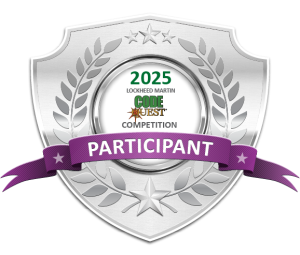
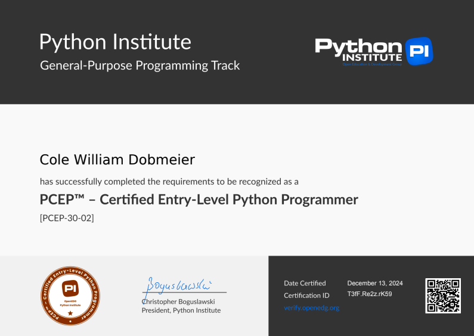

# Who I am
Hello! My name is Cole Dobmeier and I am a teen based out of in Colorado and an aspiring Computer Science Student. In college I plan to study Computer Science and the related fields in order to deepen my knowledge. Currently, I am enrolled at [Epic Campus](https://littletonpublicschools.net/schools/epiccampus/welcome), an innovative pathway that provides crucial first person experience in many pathways. I am taking part in the Computer Science pathway, where we have taken a multitude of college tours and learned the intricies of python, the depths of AI, and how to use code to manipulate real world objects. Additionally, I am enrolled in AP Computer Science A at my home high school where I have learnt the basics of Java and recently competed in the Code Quest Competition at Lockheed Martin with a top 15 finish. If you have any questions about what you see below, please feel free to email me at [cwd495@gmail.com](mailto:cwd495@gmail.com)!

# My GitHub Portfolio

Welcome to my GitHub portfolio! Below are some of my key projects. Each repository highlights a different aspect of my programming expertise, from python scripts to breadboard circuits. Feel free to explore, fork, or contribute!

## 📂 Featured Projects

### 1. [Raspberry Pi RC Car](https://github.com/cole-dobmeier/Raspberry-Pi-Car.git)
**Description:**
 A colleague and I created a wired-Remote Controlled car utilizing a Raspberry Pi, parts from a Jetson Nano car kit, and our knowledge of Pyhton to control the car.

**Features:**
- 360 degree driving operations
- Differential wheel turning speeds
- Manually adjustable car velocity

**Technologies:**
- Raspberry Pi
- Python Programming
- Jetson Nano Car Kit
- Wired NES Controller

---

### 2. [Java Projects](https://github.com/cole-dobmeier/Java-Projects.git)
**Description:**
 This repository stores all of my Java projects that I have created to understand the basics of Java code manipulation and programming.

**Technologies:**
- String Concatentation
- Array Manipulation
- Creating Constructors and Methods

---

### 3. [Raspberry Pi Stoplight](https://github.com/cole-dobmeier/Stoplight-Projects.git)
**Description:**  
Created a virtual circuit in Tinkercad to simulate a stoplight with three LEDs powered by simulated 3V coin batteries. Following our Tinkercad models, we transformed these circuits into physical circuits on Raspberry Pi's.

**Features:**
- GPIO pin control via Python
- Screenshot of the Tinkercad circuit provided.
- Button operable Stoplight, timed appropriately to a real Stoplight
- Included top-down wiring photo and a video demonstration. 

**Technologies:**  
- Tinkercad Circuits
- Raspberry Pi & Breadboard Circuitry
- Python Programming

---

### 4. [Segmented Display](https://github.com/cole-dobmeier/Segmented-Display.git)
**Description:**
 A two-part project focusing on GPIO pin management and integrating a 7-segment display with a Raspberry Pi.
**Features:**
- GPIO Cleanup Script: Turned off all Raspberry Pi GPIO pins programmatically.
- 7-Segment Display Integration: Displayed personalized messages with user input.
- Stopwatch Application: Button-controlled stopwatch with a light bulb indicator and time display on a 7-segment display.

**Technologies:**  
 - Python Programming
 - Raspberry Pi & BreadBoard Circuitry

---

### 5. [CS50 Solutions](https://github.com/cole-dobmeier/CS50_Solutions.git)
**Description:**  
CS50 is Harvard University's renowned introductory computer science course. Designed for beginners and experienced programmers alike, it provides a deep dive into core computer science concepts, including algorithms, data structures, memory management, and web development. The course emphasizes hands-on problem-solving through real-world projects, offering experience with languages like C, Python, SQL, and JavaScript, as well as tools like Git and Flask. CS50 is celebrated for its engaging lectures, challenging problem sets, and fostering a mindset for tackling complex programming challenges. Above is my linked solutions for week 0-4.
**Features:**
- Comprehensive Foundations: Covers key topics like algorithms, data structures, memory management, and web development.
- Hands-On Projects: Builds practical skills through real-world applications in languages like C, Python, and JavaScript.
- Tool Proficiency: Introduces essential tools such as Git, Flask, and SQL, preparing students for professional development environments.

**Technologies:**  
Python, CLI frameworks, VS Code

<table>
  <tr>
    <td colspan="3" align="center">
      <h3>My Github Stats!</h3>
    </td>
  </tr>
  <tr>
    <td>
      
    </td>
    <td align="center">
      
    </td>
    <td>
      
    </td>
  </tr>
</table>

<!-- 

 
<!-- 

 
 -->
 
---
## Awards

  
  

## 📬 Contact Me
If you have any questions or would like to collaborate, feel free to reach out via [cwd495@gmail.com](mailto:cwd495@gmail.com).

Thank you for visiting my portfolio!
